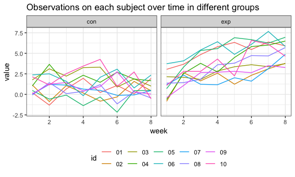

p8015\_hw5\_tl2882
================
Tian Li
2018-11-04

Problem 1
=========

Read data
---------

``` r
read_data = function(file){
  read.csv(str_c("./data/", as.character(file)))
}

file_name = list.files("./data")
output = purrr::map_df(file_name, read_data)
```

Tidy data
---------

``` r
data = output %>%
  mutate(input = file_name) %>% 
  separate(input, into = c("arm", "id"), sep = "_") %>% 
  mutate(id = str_replace(id, ".csv", "")) %>% 
  gather(key = "week", value = "value", week_1:week_8) %>% 
  mutate(week = str_replace(week, "week_", ""))

head(data)
```

    ##   arm id week value
    ## 1 con 01    1  0.20
    ## 2 con 02    1  1.13
    ## 3 con 03    1  1.77
    ## 4 con 04    1  1.04
    ## 5 con 05    1  0.47
    ## 6 con 06    1  2.37

Spaghetti plot
--------------

``` r
data %>%
  mutate(week = as.numeric(week)) %>% 
  ggplot(aes(x = week, y = value, color = id)) +
    geom_line() +
    facet_grid(~arm) + 
    labs(title = "Observations on each subject over time in different groups")
```



This is the spaghetti plot showing observations on each subject over time.
