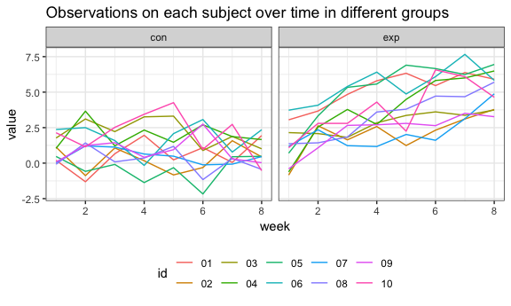
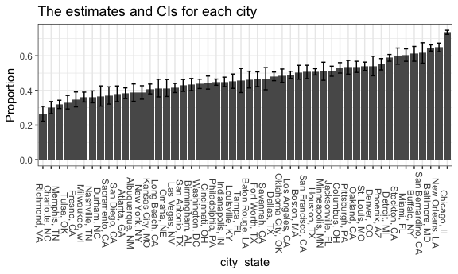

p8015\_hw5\_tl2882
================
Tian Li
2018-11-07

Problem 1
=========

Read data
---------

``` r
read_data = function(file){
  read.csv(str_c("./data/", as.character(file)))
}

file_name = list.files("./data")
output = purrr::map_df(file_name, read_data)
```

Tidy data
---------

``` r
data = output %>%
  mutate(input = file_name) %>% 
  separate(input, into = c("arm", "id"), sep = "_") %>% 
  mutate(id = str_replace(id, ".csv", "")) %>% 
  gather(key = "week", value = "value", week_1:week_8) %>% 
  mutate(week = str_replace(week, "week_", ""))

head(data)
```

    ##   arm id week value
    ## 1 con 01    1  0.20
    ## 2 con 02    1  1.13
    ## 3 con 03    1  1.77
    ## 4 con 04    1  1.04
    ## 5 con 05    1  0.47
    ## 6 con 06    1  2.37

Spaghetti plot
--------------

``` r
data %>%
  mutate(week = as.numeric(week)) %>% 
  ggplot(aes(x = week, y = value, color = id)) +
    geom_line() +
    facet_grid(~arm) + 
    labs(title = "Observations on each subject over time in different groups")
```



This is the spaghetti plot showing observations on each subject over time.

### Comment

1.  In experimental group, most values tend to grow over time in general; In control group, most values don't have many changes over time in general.

2.  Relatively, most values in experimental group are higher than those in control group.

Problem 2
=========

Read data
---------

``` r
data2 = read.csv("https://raw.githubusercontent.com/washingtonpost/data-homicides/master/homicide-data.csv")

head(data2)
```

    ##          uid reported_date victim_last victim_first victim_race victim_age
    ## 1 Alb-000001      20100504      GARCIA         JUAN    Hispanic         78
    ## 2 Alb-000002      20100216     MONTOYA      CAMERON    Hispanic         17
    ## 3 Alb-000003      20100601 SATTERFIELD      VIVIANA       White         15
    ## 4 Alb-000004      20100101    MENDIOLA       CARLOS    Hispanic         32
    ## 5 Alb-000005      20100102        MULA       VIVIAN       White         72
    ## 6 Alb-000006      20100126        BOOK    GERALDINE       White         91
    ##   victim_sex        city state      lat       lon           disposition
    ## 1       Male Albuquerque    NM 35.09579 -106.5386 Closed without arrest
    ## 2       Male Albuquerque    NM 35.05681 -106.7153      Closed by arrest
    ## 3     Female Albuquerque    NM 35.08609 -106.6956 Closed without arrest
    ## 4       Male Albuquerque    NM 35.07849 -106.5561      Closed by arrest
    ## 5     Female Albuquerque    NM 35.13036 -106.5810 Closed without arrest
    ## 6     Female Albuquerque    NM 35.15111 -106.5378        Open/No arrest

The dimension of the raw data is `52179, 12` (number of observations, variables).

Vriable names are `uid, reported_date, victim_last, victim_first, victim_race, victim_age, victim_sex, city, state, lat, lon, disposition`.

Count homicides
---------------

``` r
data_count = data2 %>% 
  unite(city_state, city, state, sep = ", ") %>% 
  group_by(city_state) %>% 
  summarise(n_unsolved = sum(disposition %in% c("Closed without arrest", "Open/No arrest")),
            n_total = n())

head(data_count)
```

    ## # A tibble: 6 x 3
    ##   city_state      n_unsolved n_total
    ##   <chr>                <int>   <int>
    ## 1 Albuquerque, NM        146     378
    ## 2 Atlanta, GA            373     973
    ## 3 Baltimore, MD         1825    2827
    ## 4 Baton Rouge, LA        196     424
    ## 5 Birmingham, AL         347     800
    ## 6 Boston, MA             310     614

"data\_count" is the dataframe which shows the total number of homicides and the number of unsolved homicides according to cities.

Proportion test
---------------

### Baltimore

``` r
data_bal = 
  data_count %>% 
  filter(city_state == "Baltimore, MD")

prop_bal = prop.test(data_bal$n_unsolved, data_bal$n_total)

prop_bal %>% 
  broom::tidy() %>% 
  select(estimate, conf.low, conf.high)
```

    ## # A tibble: 1 x 3
    ##   estimate conf.low conf.high
    ##      <dbl>    <dbl>     <dbl>
    ## 1    0.646    0.628     0.663

For the city of Baltimore, MD, the estimate proportion is 0.646, and the CI is (0.628, 0.663).

### All cities

``` r
prop_all = 
  data_count %>% 
  mutate(tests = purrr::map2(.x = data_count$n_unsolved, .y = data_count$n_total,
                                ~broom::tidy(prop.test(.x, .y)))) %>% 
  unnest() %>% 
  select(city_state, estimate, conf.low, conf.high)
```

    ## Warning in prop.test(.x, .y): Chi-squared approximation may be incorrect

``` r
head(prop_all)
```

    ## # A tibble: 6 x 4
    ##   city_state      estimate conf.low conf.high
    ##   <chr>              <dbl>    <dbl>     <dbl>
    ## 1 Albuquerque, NM    0.386    0.337     0.438
    ## 2 Atlanta, GA        0.383    0.353     0.415
    ## 3 Baltimore, MD      0.646    0.628     0.663
    ## 4 Baton Rouge, LA    0.462    0.414     0.511
    ## 5 Birmingham, AL     0.434    0.399     0.469
    ## 6 Boston, MA         0.505    0.465     0.545

"prop\_all" is the tidy dataframe with estimated proportions and CIs for each city.

Bar lot
-------

``` r
prop_all %>% 
  filter(city_state != "Tulsa, AL") %>% 
  mutate(city_state = fct_reorder(city_state, estimate)) %>%
  ggplot(aes(x = city_state, weight = estimate)) +
    geom_bar() + 
    geom_errorbar(aes(ymin = conf.low, ymax = conf.high), width = 0.5) +
    labs(title = "The estimates and CIs for each city", y = "Proportion") +
    theme(axis.text.x = element_text(angle = -90))
```



This is the bar plot that shows the estimates and CIs for each city.
